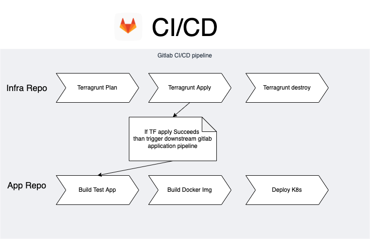

# Infrastructure Problem

Deploy Clojure app aka [infra-problem repository](https://github.com/ThoughtWorksInc/infra-problem)

**Note/Updates**

Newfeed service doesn't work eventhough all the tests pass locally aswell on cloud. 
Related to this issue on repo [Issue 8](https://github.com/ThoughtWorksInc/infra-problem/issues/8)


## Getting started

Deploy app & infra from local system.

## **Pre-requiste:**

1. AWS Account
2. Create IAM user and download Access key and Secret key
4. Install following packages on local system
    - Python3
    - AWS CLI
    - Docker
    - Kubectl
    - Helm
    - Terraform
    - Terragrunt
    - JDK 8
    - Clojure
    - Leiningen

## **Setup Infrastructure:**

1. Configure AWS CLI with access key, secret key and region
2. Set vars using run `pre.deploy.sh -r <aws_region> -p <aws_profile>` file. (if you don't have an aws profile configured then give `default` as input for profile/-p.)
3. Run `deploy-infra.sh` script, this deploy AWS infra using terragrunt. (Takes around 10-15mins to deploy whole infra)

## **Setup Application**

Once the infra is ready you can proceed to building and deploying application.

1. Run `deploy-app.sh` script, this will build/test/deploy app to EKS Cluster.

Note:
- Image versioning is handled automatically via `image.env` file once `deploy-app.sh` is executed.
- App tests can be run using `helm test clojure-app` OR uncomment `helm_test` function in `deploy-app.sh` and rerun script.

## **Setup Monitoring**

Setup kubernetes dashboard and access locally or even install `Lens` to view cluster metrics/logs (Recommended)

Go to `monitoring` dir and refer 

Monitoring could be improved as future update by deploying daemon set of datadog or newrelic along with pods.

## **Destroy Infra & App**

Uncomment `destroy` functions from `deploy-app.sh` and `deploy-infra.sh`.

## Multi Environment CI/CD

- Using Terragrunt we can create multiple terraform infra by replicating `terragrunt.hcl` directory structure for each env.

- Gitlab CI/CD pipeline can be pepared for both infra and application where infra will have a ci/cd pipeline which deploy to every single environment using terragrunt and with an upstream pipeline which handles CI/CD of application.



## Future updates

- CI/CD pipeline for infra aswell as application couple together to give a single interface and overview of whole release pipeline.
- MR based CI/CD pipeline triggers on Gitlab
- Role based authentication for terragrunt &  CI/CD pipelines


----
# APP USAGE

This project contains three services:

* `quotes` which serves a random quote from `quotes/resources/quotes.json`
* `newsfeed` which aggregates several RSS feeds together
* `front-end` which calls the two previous services and displays the results.

## Prerequisites

* Java
* [Leiningen](http://leiningen.org/) (can be installed using `brew install leiningen`)

## Running tests

You can run the tests of all apps by using `make test`

## Building

First you need to ensure that the common libraries are installed: run `make libs` to install them to your local `~/.m2` repository. This will allow you to build the JARs.

To build all the JARs and generate the static tarball, run the `make clean all` command from this directory. The JARs and tarball will appear in the `build/` directory.

### Static assets

`cd` to `front-end/public` and run `./serve.py` (you need Python3 installed). This will serve the assets on port 8000.

## Running

All the apps take environment variables to configure them and expose the URL `/ping` which will just return a 200 response that you can use with e.g. a load balancer to check if the app is running.

### Front-end app

`java -jar front-end.jar`

*Environment variables*:

* `APP_PORT`: The port on which to run the app
* `STATIC_URL`: The URL on which to find the static assets
* `QUOTE_SERVICE_URL`: The URL on which to find the quote service
* `NEWSFEED_SERVICE_URL`: The URL on which to find the newsfeed service
* `NEWSFEED_SERVICE_TOKEN`: The authentication token that allows the app to talk to the newsfeed service. This should be treated as an application secret. The value should be: `T1&eWbYXNWG1w1^YGKDPxAWJ@^et^&kX`

### Quote service

`java -jar quotes.jar`

*Environment variables*

* `APP_PORT`: The port on which to run the app

### Newsfeed service

`java -jar newsfeed.jar`

*Environment variables*

* `APP_PORT`: The port on which to run the app


----
## FAQ

```
Error saving credentials: error storing credentials - err: exit status 1, out: `Post "http://ipc/registry/credstore-updated": dial unix /Users/bhargav.amin/Library/Containers/com.docker.docker/Data/backend.sock: connect: connection refused`
```
`Solution remove ~/.docker/config.json`